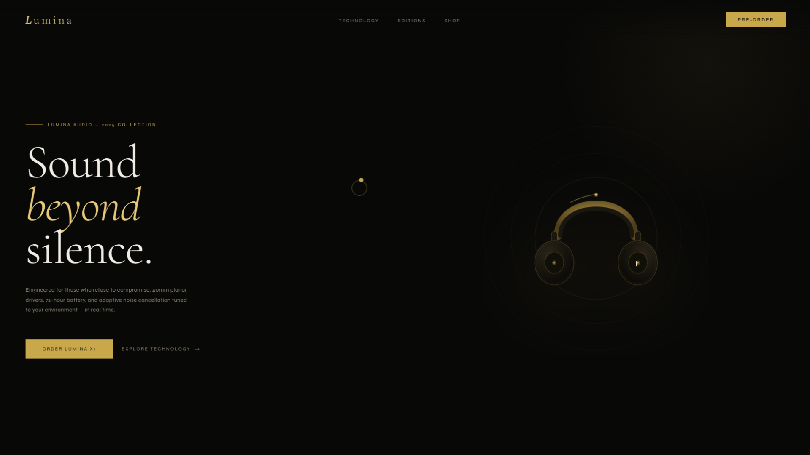
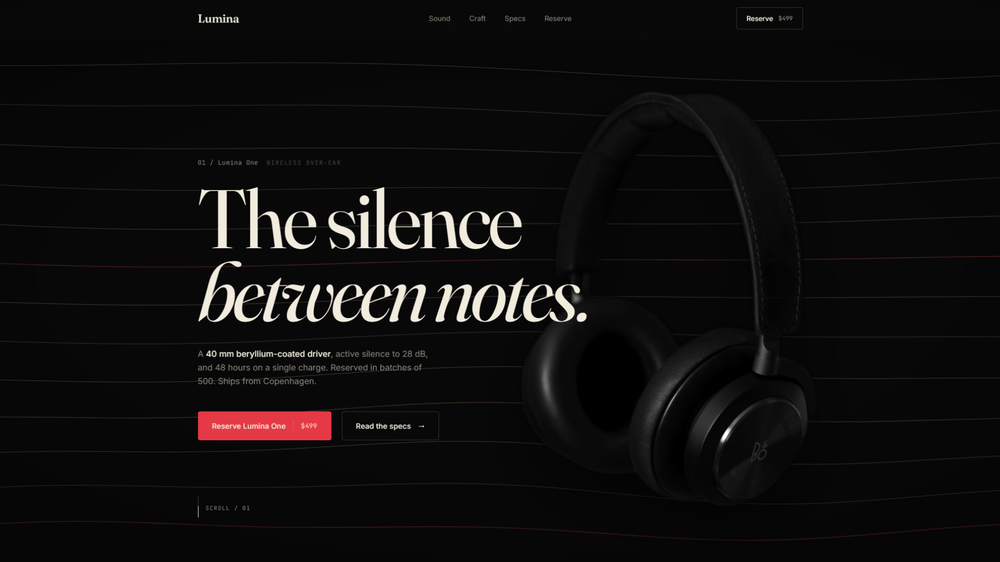

# anti-slop-ui

A Claude Code skill that eliminates the AI-generated look from any frontend. Purple gradients, pill-shaped cards, Inter font, "Welcome to [Product]" heroes, em dashes in every sentence. You know the look. This kills it.

## Before and after




Same brand brief. Same model. The only difference is the skill.

**Before.** Decorative dash before an uppercase eyebrow label. Italic accent on one word of a generic tagline. Product buried inside an abstract orbital graphic instead of shown directly. Specs exist but are vague and buried in body copy. No price on the CTA.

**After.** Product photo bleeds off the edge as the hero. Spec copy is concrete: 40 mm beryllium-coated driver, 28 dB active silence, 48 hours per charge, batches of 500, ships from Copenhagen. Price on the CTA. Plain section marker (`01 / Lumina One`), uniform wordmark, asymmetric layout.

## Install

Run this from anywhere. It installs to `~/.claude/skills/anti-slop-ui/` (global) and wires the skill into `~/.claude/CLAUDE.md` so Claude loads it in every project.

**macOS and Linux**

```bash
curl -sL https://raw.githubusercontent.com/awaken7050dev/anti-slop-ui/main/install.sh | bash
```

**Windows (PowerShell)**

```powershell
irm https://raw.githubusercontent.com/awaken7050dev/anti-slop-ui/main/install.ps1 | iex
```

One install. Works globally. Next time you run `claude` in any project, the skill is registered as `/anti-slop-ui`.

## Use it

Run it as a slash command inside Claude Code:

```
/anti-slop-ui
```

That triggers the intake questions. Or pass your request inline:

```
/anti-slop-ui build a landing page for a SaaS analytics tool
/anti-slop-ui redesign the dashboard to look like Stripe
/anti-slop-ui this portfolio looks generic, polish it
```

The skill runs the audience, impression, mode, stack, logo, and pages intake, commits to a plan in one sentence, and builds from there. It self-audits against the 33 tells before declaring the work done.

The installer also wires the skill into `.claude/CLAUDE.md`, so Claude reads it passively on frontend tasks even without the slash command. Use `/anti-slop-ui` when you want to force the full intake. Skip it when you are already mid-conversation and just want the rules applied.

## What the skill does

Before writing a single line of code, the skill forces three decisions:

1. **Audience.** Executive, developer, consumer, or creative. Each one has a different tolerance for density, color, and motion.
2. **Impression level.** A 1 to 5 scale from Bloomberg Terminal to Apple product page. The level determines type scale, color usage, and how much visual weight is allowed.
3. **Light or dark mode.** Committed upfront, so both states are designed, not retrofitted.

From those answers, Claude picks the design tokens, component patterns, and layout rules that match. It then applies a 33-point filter to eliminate the most common AI tells, and runs a pre-ship checklist before declaring the work done.

## What it kills

Thirty specific AI tells, grouped into four families:

- **Visual defaults.** Generic gradients, pill-shaped everything, component libraries shipped untouched.
- **Typography mistakes.** Display fonts on every heading, Inter with no hierarchy, hero text that breaks on mobile.
- **Layout giveaways.** Symmetric three-card grids, consumer-app spacing on dashboards, motion that adds nothing.
- **Content slop.** Em dashes in every sentence, unverified marketing copy, placeholder images in production.

The full list, the enforcement rules, a pre-ship checklist, and twenty-six battle scars from real projects live inside the skill.

## The impression scale

```
1   INVISIBLE      Bloomberg Terminal. Data is the product.
2   RESTRAINED     Stripe Dashboard. Quiet and trustworthy.
3   BALANCED       Notion. Modern SaaS defaults.
4   EXPRESSIVE     Raycast. Memorable and opinionated.
5   SPECTACULAR    Apple product page. Every pixel considered.
```

Pick the wrong level and a dashboard feels like a toy, or a landing page feels like a tax form. The skill ties each level to concrete token values so Claude cannot drift.

## What is in the box

| File         | Size  | Purpose                                                                |
| ------------ | ----- | ---------------------------------------------------------------------- |
| `SKILL.md`   | 52 KB | Full design system, 33 tells, tokens, component patterns, checklists, battle scars |
| `BRAIN.md`   | 7 KB  | Optional reasoning architecture for larger, multi-page builds          |
| `PREMIUM.md` | 25 KB | Level 4-5 offensive playbook: font pairings, OKLCH palettes, layered shadows, spring easing, noise textures, glassmorphism, border glow, micro-interactions, hero recipes |

Three Markdown files. No runtime, no dependencies, no build step. Stack-agnostic: React, Next.js, Vue, Svelte, plain HTML, Tailwind, vanilla CSS, anything.

## How it works under the hood

1. The installer drops `SKILL.md`, `BRAIN.md`, and `PREMIUM.md` into `~/.claude/skills/anti-slop-ui/` (global).
2. It appends a reference to `~/.claude/CLAUDE.md` so Claude reads the skill before any frontend task in any project.
3. Invoke with `/anti-slop-ui [optional prompt]`, or let it activate passively on frontend tasks via the CLAUDE.md reference. Either path runs the intake and applies the matching design system.
4. For Level 4-5 builds, Claude loads `PREMIUM.md` on demand for the full offensive playbook. Lower impression levels skip it to save tokens.
5. Before declaring the task done, Claude self-audits against the 33 tells and the pre-ship checklist.

If you already have a `~/.claude/CLAUDE.md`, the installer appends without overwriting. If you do not, it creates one.

## Uninstall

```bash
rm -rf ~/.claude/skills/anti-slop-ui
```

Then remove the `## Skills` block from `~/.claude/CLAUDE.md`.

## License

MIT. Use it, fork it, ship it.

---

Built by [@awaken7050dev](https://github.com/awaken7050dev).
